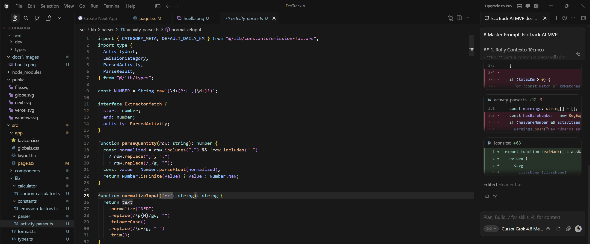
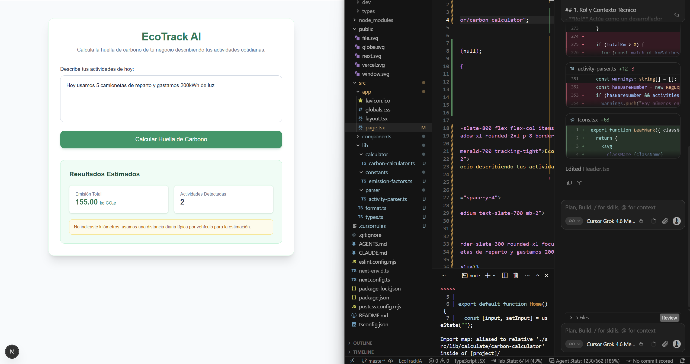

# Bitácora de Desarrollo: EcoTrack AI (Capstone MVP)

## 1. Descripción General y Objetivos
**EcoTrack AI** es una aplicación web minimalista orientada a pequeños negocios para calcular de forma simplificada su huella de carbono a partir de descripciones cotidianas en lenguaje natural (ej. *"Hoy usamos 5 camionetas de reparto y gastamos 200kWh de luz"*). El proyecto fue desarrollado bajo los principios de *Vibe Coding* y orquestación de agentes de IA, manteniendo un control estricto de la arquitectura y la separación de responsabilidades.

- **Stack Tecnológico:** Next.js (App Router), TypeScript, Tailwind CSS.
- **Enfoque Arquitectónico:** Modular, desacoplando la lógica de negocio, las constantes de emisión y el parser de lenguaje natural de los componentes visuales del frontend.

---

## 2. Configuración del Entorno y Gobernanza (.cursorrules)
Para asegurar que el agente de IA mantuviera los estándares técnicos del proyecto, se estableció un contrato de reglas en la raíz del repositorio (`.cursorrules`):

```markdown
# EcoTrack AI - Development & Architecture Rules

## 1. Rol y Contexto
- Actúa como un desarrollador senior y arquitecto de software experto en Next.js, React, Tailwind CSS y TypeScript.
- Eres el agente principal de implementación del proyecto "EcoTrack AI", un MVP enfocado en ayudar a pequeños negocios a calcular su huella de carbono de forma simplificada mediante lenguaje natural.

## 2. Objetivo Central
- Procesar entradas de texto en lenguaje natural de negocios (ej. "Hoy usamos 5 camionetas de reparto y gastamos 200kWh de luz") para extraer variables clave (transporte, energía, etc.).
- Calcular la huella de carbono estimada de forma local utilizando factores de emisión estáticos (NO uses APIs externas ni servicios de pago para el cálculo).

## 3. Arquitectura y Separación de Responsabilidades
- **Componentes limpios:** Mantén las vistas de React desacopladas de la lógica de procesamiento y cálculo.
- **Constantes:** Centraliza los factores de emisión de CO2 (kWh, vehículos comerciales, etc.) en un archivo dedicado.
- **Utilidades y Parser:** Modula la lógica de análisis de texto en lenguaje natural y las funciones matemáticas en carpetas independientes (`lib/` o `utils/`).
- **Tipado robusto:** Utiliza TypeScript adecuadamente evitando el uso innecesario de `any`.

## 4. Manejo de Errores y Resiliencia
- El parser local debe ser tolerante a fallos: ante entradas vacías, actividades desconocidas o valores inválidos, debe retornar mensajes amigables sin romper la aplicación.

## 5. Permisos y Autonomía del Agente
- Tienes permitido crear/modificar archivos, instalar dependencias en la terminal (`npm install`), refactorizar y solucionar errores por tu cuenta.
- No pidas que escriba código manualmente si puedes implementarlo tú.
- Si ocurren errores de importación o dependencias faltantes, investiga la causa raíz y ejecuta los comandos necesarios para solucionarlos inmediatamente de forma autónoma.
```

# Master Prompt: EcoTrack AI MVP

## 1. Rol y Contexto Técnico
- **Rol:** Actúa como un desarrollador senior y arquitecto de software especializado en Next.js, TypeScript y Tailwind CSS.
- **Objetivo:** Diseñar y construir el MVP funcional para "EcoTrack AI", una aplicación web dirigida a pequeños negocios para calcular su huella de carbono de forma simplificada a partir de lenguaje natural.

## 2. Requerimientos de Interfaz (UI/UX)
- **Estética:** Diseño minimalista, moderno, responsivo y con temática ecológica (predominio de tonos verdes y grises limpios).
- **Componente Principal:** Un área de texto interactiva o input inteligente donde el usuario pueda describir sus actividades diarias de forma cotidiana (ejemplo: *"Hoy usamos 5 camionetas de reparto y gastamos 200kWh de luz"*).

## 3. Requerimientos de Lógica y Arquitectura
- **Procesamiento de Lenguaje:** Implementar una lógica determinista y local (parser mediante expresiones regulares o palabras clave) que interprete el texto y extraiga variables numéricas clave (unidades de transporte, consumo eléctrico, etc.).
- **Motor de Cálculo:** Calcular de forma estimada los kilogramos de CO2 equivalentes utilizando factores de emisión estáticos almacenados en un archivo de constantes independiente.
- **Visualización de Resultados:** Presentar el desglose de emisiones y el total en tarjetas de resumen claras, ordenadas y visuales.
- **Resiliencia:** Incluir un manejo de errores amigable y robusto ante entradas vacías o actividades no reconocidas por el sistema.
- **Modularidad:** Mantener una estricta separación de responsabilidades (componentes de UI limpios, lógica de negocio desacoplada y tipado estricto en TypeScript).

# Implementación del Motor de Procesamiento (NLP Local)

La funcionalidad central de análisis de lenguaje natural se implementó en src/lib/parser/activity-parser.ts, permitiendo procesar texto libre sin necesidad de APIs externas complejas:





## 5. Desafíos Técnicos y Resolución Asistida por IA

Durante el desarrollo iterativo, se presentó el siguiente desafío crítico:

### Desafío

Tras la generación modular de la arquitectura, se produjo un error de resolución de módulos y tipado:

`Cannot find module '@/lib/calculator'`

El problema se originó debido a discrepancias en las rutas de importación del archivo principal `page.tsx` después de alcanzar los límites de uso del agente.

### Resolución Asistida

Se utilizó el asistente de co-programación para auditar la estructura de carpetas (`src/lib/carbon-calculator.ts` frente a la ruta esperada), ajustando los enlaces de importación y el tipado estricto en TypeScript.

Esto permitió garantizar una integración limpia entre el parser y la interfaz visual, sin requerir una codificación manual exhaustiva.

---

## 6. Evidencias y Validación del MVP

El sistema fue probado exitosamente en un entorno local (`localhost:3000`), validando los flujos principales del MVP.

### ✅ Happy Path

Al ingresar el texto:

> "Hoy usamos 5 camionetas de reparto y gastamos 200kWh de luz"

el sistema procesó correctamente **2 actividades detectadas** y obtuvo un estimado de **155.00 kg CO₂e**.

Además, se verificó la correcta visualización de:

- Tarjetas de resumen.
- Resultados de las actividades detectadas.
- Advertencias correspondientes a la estimación de distancia.

### 🎨 Estructura Visual

Se comprobó la correcta aplicación de:

- Paleta de colores ecológicos.
- Diseño responsivo.
- Distribución visual de los componentes de la interfaz.

### ⚠️ Manejo de Errores y Casos Borde

Se validaron las respuestas ante:

- Textos vacíos.
- Frases no reconocidas.
- Entradas que no contienen actividades válidas.

En estos casos, la aplicación despliega avisos informativos de forma amigable y mantiene la ejecución sin errores críticos.

### Video Demo

[https://youtu.be/WGxCJNlNatQ](https://youtu.be/WGxCJNlNatQ)

---

## 7. Presentación del Producto y Aceleración con "Vibe Coding"

El desarrollo de **EcoTrack AI** demostró cómo el enfoque de **Vibe Coding** permite pasar de la idea al Producto Mínimo Viable (MVP) funcional en una fracción del tiempo tradicional. 

### Aceleración frente a Métodos Tradicionales
- **Dirección vs. Sintaxis:** En lugar de invertir horas escribiendo código repetitivo de formularios, configurando rutas de Next.js o redactando expresiones regulares complejas desde cero, el rol se desplazó hacia la **arquitectura y la dirección creativa**. La IA asumió la ejecución de la sintaxis mientras que la supervisión humana guio la lógica de negocio.
- **Iteración Instantánea:** La corrección de errores de tipado, la estructuración modular (`lib/parser`, `lib/calculator`) y la adaptación del diseño visual ecológico se resolvieron mediante lenguaje natural y prompts de control, reduciendo drásticamente el tiempo de depuración.
- **Despliegue Rápido:** Gracias a la co-programación asistida, el prototipo pasó de la conceptualización inicial a un entorno de producción en vivo (Vercel) de forma fluida, cumpliendo con todos los requerimientos del Capstone de manera eficiente.

---

## 8. Registro explícito de orquestación

La IA no recibió la instrucción genérica de “hacer una app”. Se le entregó contexto, límites y criterios de aceptación, y cada bloque se revisó antes de continuar. Estos son los prompts de trabajo que resumen la orquestación:

### Prompt 1 — Definición de intención

> Construye un MVP llamado EcoTrack AI para pequeños negocios. La persona debe poder describir actividades cotidianas en lenguaje natural y obtener una estimación de kg CO₂e. Prioriza una experiencia simple, clara y usable en español. Antes de implementar, propón una arquitectura modular y enumera los supuestos que deberán mostrarse al usuario.

**Decisión humana:** mantener el alcance pequeño: electricidad, combustibles y transporte. No incluir cuentas, base de datos ni APIs externas en esta primera versión.

### Prompt 2 — Contrato técnico

> Implementa el parser como una función pura y determinista en TypeScript. Separa extracción, factores de emisión y cálculo. Devuelve estados para entrada vacía, texto no reconocido y resultado válido. Mantén los factores en constantes y evita `any`.

**Resultado esperado:** `parseActivities` devuelve actividades tipadas y `calculateFootprint` convierte cada actividad en un desglose auditable.

### Prompt 3 — Orquestación de interfaz

> Crea una interfaz responsive en Next.js con un área de texto, ejemplos seleccionables, un botón de cálculo y un resultado que muestre total, actividades detectadas, factores y advertencias. Usa lenguaje comprensible para una persona no técnica y explica que el resultado es una estimación.

**Decisión humana:** mostrar el factor y la unidad junto a cada resultado para que el cálculo no parezca una caja negra.

### Prompt 4 — Depuración

> Audita la estructura de imports y tipos del proyecto. Si aparece `Cannot find module '@/lib/calculator'`, localiza el archivo real, corrige la ruta y ejecuta lint/build. Revisa también que no haya `any` innecesario.

**Resultado:** se corrigió la importación hacia `@/lib/calculator/carbon-calculator`; en la versión de entrega se reemplazó el estado `any` de la interfaz por `CalculationResult`.

### Prompt 5 — Validación

> Valida un caso exitoso con energía y vehículos, una entrada vacía y una frase sin cantidades reconocibles. Compara los resultados con el cálculo manual y registra las advertencias sobre distancia asumida.

**Resultado de referencia:** 200 kWh producen 80 kg CO₂e; 5 camionetas con 60 km diarios asumidos producen 75 kg CO₂e; el total esperado es 155 kg CO₂e.

## 9. Iteración final de entrega

La entrega se reforzó después de la retroalimentación recibida:

- se dejaron las instrucciones de ejecución centradas en la carpeta local del proyecto;
- se normalizó el nombre de la bitácora a `BITACORA.md`;
- se agregó un comando `npm run verify` para ejecutar lint y build;
- se eliminó el estado `any` de la pantalla principal;
- se agregaron ejemplos interactivos y un desglose visible por actividad;
- se añadieron `VIBE_REPORT.md`, `docs/ENTREGA.md`, `docs/PRUEBAS.md` y `docs/PROMPTS.md`;
- se documentaron las limitaciones de los factores estáticos y del parser local.

El objetivo de esta iteración no fue aparentar que el MVP es un sistema de medición certificado, sino hacer verificables sus decisiones, supuestos y límites.